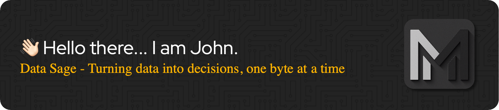

<picture>
  <source srcset="assets/github-header-image-light.png" media="(prefers-color-scheme: light)">
  <source srcset="assets/github-header-image.png" media="(prefers-color-scheme: dark)">
  
</picture>

❗❗❗ **I AM WORKING ON ENHANCING THE PROFILE PAGE** ❗❗❗

### Hi there, I'm John 👋 

<!--  -->

## I'm a Husband, Father and Developer!!

- 🌱 I love learning new frameworks and keep myself up-to-date with the latest. 🤣
- 🥅 2025 Goals: Develop Ai Agents and create automation on Apps using Ai Agents. -> IN_PROGRESS
- 🥅 2024 Goals: Learn Machine Learning, Deep Learning and Neural Networks. -> Concepts DONE
- 🥅 2023 Goals: Modernize high performing Apps to use Reactive programing. -> DONE
- 🥅 2022 Goals: Grow in React and JS + Learn and practice Machine Learning -> DONE
- 🥅 2021 Goals: Learn React : Update -> DONE.
- ⚡ John facts: Play Drums 🥁 | Landscape Photography 📷 | Play Golf ⛳ and Tennis 🎾 | Woodworking 🪵
- 💰 NYSE: Keep up to date with the stock market and actively invest every peny.

## 🚀 About Me:

- 🧔 Senior Sofware Engineer concentrated on Web Applications and real-time protocols.
- 🌐 Passionate about large-scale solutions w/ Java & Spring Framework, Python and high performance databases.

 

## Programming Languages and Frameworks:

  
  
  
  
  

### Web Application Development
I have leverage Java for most of my professional career and Spring to facilitate most of the cross-cutting concerns when building large-scale web solutions.

<!--

Extensive Experience in Architecting Scalable Solutions
	•	Web Application Development:
Leveraged Java (versions 7 to 21) and Spring Framework (including Spring Boot, Spring Data, Spring Web, and Spring Security) to design and develop robust, scalable, and secure web applications.
	•	Focused on implementing clean architecture principles, modular designs, and reusable components to improve code maintainability and team productivity.
	•	Delivered high-performing enterprise-grade applications capable of supporting millions of users with low-latency responses and a seamless user experience.
	•	Built reactive programming-based applications with Spring WebFlux to handle concurrent users efficiently.
	•	Event-Driven Architectures:
Architected and implemented event-driven applications using tools like Apache Kafka to enable real-time, asynchronous communication between Business-to-Business (B2B) and Application-to-Application (A2A) systems.
	•	Designed event-driven microservices for downstream data propagation, ensuring high availability, resilience, and fault tolerance.
	•	Streamlined business workflows by replacing traditional batch processing with event-based solutions, significantly reducing latency and improving system responsiveness.
	•	Built centralized event replication systems to integrate third-party and internal applications into a unified communication framework.
	•	B2B Communication:
Developed secure APIs and message-based solutions for external business partners to interact seamlessly with internal systems.
	•	Ensured adherence to compliance and security standards by integrating OAuth2, JWT, and API Gateway patterns.
	•	Improved the onboarding process of external partners by automating the integration pipeline.
	•	A2A System Communications:
Spearheaded projects to integrate various internal systems using event streaming for data synchronization and workflow automation.
	•	Reduced manual intervention and human error by automating data exchanges and dependency resolution.
	•	Enhanced system scalability by implementing queue-based solutions for real-time processing and retry mechanisms.

This experience highlights your ability to deliver high-impact solutions by combining modern frameworks and event-driven designs to address complex business challenges and scale enterprise systems effectively.

-->

### Programming Preferences

Prototyping - why?

## Databases:

  
## Repositories and Tools:

## Environments and Documentation 

 
 
